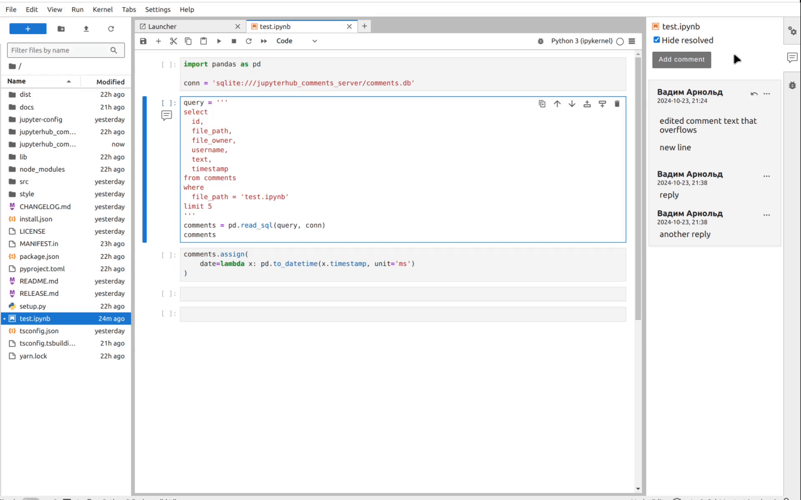

# Table of contents
* [Features](#examples)
  * [Add comments](#add-comments)
  * [Reply to comments](#reply-to-comments)
  * [Edit comments](#edit-comments)
  * [Delete comments](#delete-comments)
  * [Resolve comments](#resolve-comments)
  * [Comment indicators](#comment-indicators)
  * [Go to a comment](#go-to-a-comment)
    * [Notebook](#notebook)
    * [Editor](#document)
* [Other](#other)
  * [Hotkeys](#hotkeys)
  * [Users](#users)
  * [Full user names](#full-user-names)

# Features

## Add comments

In notebooks comments are linked to cells that are currently selected and in documents they are linked to selected lines.

If notebooks cell is deleted or document line text changes, comment is linked to first cell / line by default


## Reply to comments

Replied can be added to level 1 comments


## Edit comments


## Delete Comments

If parent comment is deleted, whole thread is deleted



## Resolve comments

Level 1 comments can be resolved, which hides the whole thread by default


## Comment indicators

If comment is added to cell / line it is indicated by comment icon next to it. Clicking an icon opens comments interface and highlites a comment


## Go to a comment
### Notebook

Clicking a notebook comment in the interface focuses a cell comment is linked to


### Document

Clicking a document comment in the interface focuses a line comment is linked to


# Other

## Storing comments

To share comments between users, provide `JUPYTERHUB_COMMENTS_DB_PATH` environment variable with directory where comments.db file should be stored. By default comments are stored in directory where extension is installed, which could be different for different users

## Hotkeys

When the comment text editor is focused, you can press `Ctrl+Enter` to save a comment and `Esc` to cancel

## Users

The system user is used as a comment author. Only the author can edit and delete their comments

## Full user names

You can implement a function that extracts full usernames from the JupyterHub system username by creating `jupyterhub_comments/username.py` with a `try_getting_full_username(username)` function.

For example this function can pull a username from Active Directory or a database. Code that pulls a name from active directory:

```python
def try_getting_full_username(username):
    '''
    try extracting real name of the user from active
    directory
    '''
    if '.' not in username:
        raise(ValueError('username for Active Directory should contain "."'))
    import ldap
    ldap.set_option(ldap.OPT_X_TLS_REQUIRE_CERT, ldap.OPT_X_TLS_NEVER)
    l = ldap.initialize('ldaps://<hostname>:3269')
    l.simple_bind_s('<username>', '<password>')
    data = l.search_s(
        'dc=<dc>,dc=local',
        scope=ldap.SCOPE_SUBTREE,
        attrlist=['displayName'],
        filterstr=f'(&(userPrincipalName=<ldap-username>)(objectClass=top))'
    )
    name_parts = data[0][1]['displayName'][0].decode('utf-8').split(' ')
    return ' '.join([name_parts[1], name_parts[0]])
```